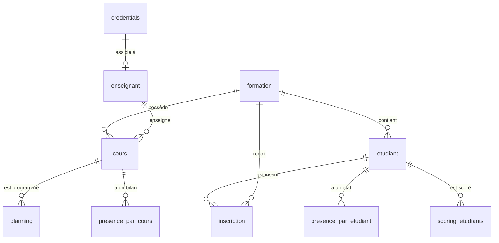

# Architecture de la Base de Données (PostgreSQL)

Le projet utilise une architecture **Medallion** (Bronze → Silver → Gold) pour garantir la qualité et la traçabilité des données.

---

## 🏗️ 1. Diagramme Conceptuel (Mermaid)

---

## 🗂️ 2. Description des Schémas

### 📁 Schema : `ref` (Référentiel)
Données de base structurantes de l'institut.
- `formation` : Liste des filières (ID, Intitulé, Niveau, Tarif).
- `etudiant` : Informations personnelles des élèves.
- `enseignant` : Liste des professeurs (Numéro ENS, Nom, Prénom).
- `cours` : Catalogue des matières (associées à un enseignant et une formation).
- `planning` : Emploi du temps quotidien (Date, Session, Salle).
- `inscription` : Table de jointure Étudiant <-> Formation.
- `credentials` : **(Sécurité)** Stocke les logins, rôles (`admin`, `teacher`) et mots de passe hachés (SHA-256).

### 📁 Schema : `bronze` (Données Brutes)
Stockage des fichiers Excel extraits sans transformation.
- `presence_raw` : Données importées du portail enseignant avec métadonnées techniques.

### 📁 Schema : `silver` (Données Nettoyées)
Données dédoublonnées et normalisées.
- `presence_clean` : État de présence consolidé (un record par étudiant/séance).

### 📁 Schema : `gold` (Vues Métier / KPIs)
Données agrégées prêtes pour le Dashboard.
- `presence_par_cours` : Statistiques d'assiduité par session.
- `presence_par_etudiant` : Historique individuel de présence.
- `retour_feuilles` : Suivi de la collecte des fichiers par enseignant.
- `absences_repetees` : Alertes automatiques pour les absences consécutives.
- `scoring_etudiants` : Scores de sérieux et badges.

---

## 🔒 3. Sécurité des Données
- **Hachage** : Les mots de passe ne sont jamais stockés en clair. Ils sont hachés via `hashlib` (PBKDF2/SHA256).
- **Isolation** : L'interface Prof n'a accès qu'en lecture aux tables `ref` nécessaires et n'écrit que dans `bronze`.

---

## 🔄 4. Flux d'Actualisation
1. **Source** : Fichier Excel (Portail Prof).
2. **Collecte** : Jobs Spark (Airflow).
3. **Transformation** : Pipeline Medallion (ETL).
4. **Visualisation** : Dashboard Streamlit (Admin).

*Dernière mise à jour : Mai 2026*
